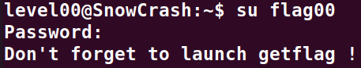

# Level00 :

**Pour ce premier exercise, nous allons simplement chercher dans tous les dossiers du system la liste des fichiers qui appartiennent a "flag00" a l'aide de la commande suivante:**

`find / -user flag00 -exec ls {} \; 2>/dev/null`

**En suite il suffit de regarder d'afficher le contenu des fichiers trouves**

`find / -user flag00 -exec cat {} \; 2>/dev/null`

**Nous obtenons donc une string : "cdiiddwpgswtgt"**
**Ce n'est tout de meme pas le password de "flag00" mais en cherchant dans les algorithmes de chiffrement de base on tombe sur un code cesar avec une cle de 15**
**Ce qui finalement nous donne : "nottoohardhere"**

