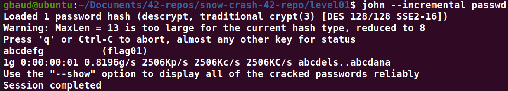
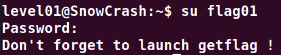

# Level01 :

**Pour ce deuxieme exercise, nous allons copier le fichier /etc/passwd vers notre session avec scp:**
`scp -P 4242 level01@192.168.253.129:/etc/passwd .`

**Nous allons en suite executer JohnTheRipper sur ce fichier a l'aide de la commande suivante:**
`john --incremental passwd`

**Bingo !, comme le montre cette capture d'ecran nous trouvons donc le mot de passe "abcdefg"**

