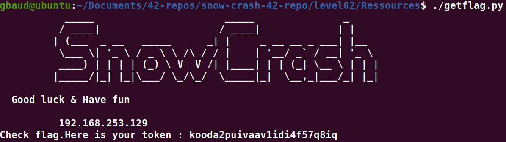

# Level02 :

**En se connectant a la session en tant que "level02" on tombe sur un fichier "level02.pcap", nous allons copier le fichier vers notre session avec scp:**
`scp -P 4242 level02@192.168.253.129:~/level02.pcap .`

**Nous allons en suite en extraire les packets:**
`tshark -r "level02.pcap" -T json > packets.json`

**Puis nous allons nous servir du fichier python fournis dans le dossier Ressources pour en extraire la chaine du password**

`./extract.py | cat -e`

`Password: ft_wandr^?^?^?NDRel^?L0L^M^@^M`
**Ce qui revient si on le pouvait a ecrire "ft_wandr[Ctrl+/][Ctrl+/][Ctrl+/]NDRel[Ctrl+/]LOL[Ctrl+M][Ctrl+2][Ctrl+M]", en sachant que le NULL-Byte est skip.**
**Comme ce n'est pas possible de l'ecrire comme cela on peut y parvenir en utilisant sshpass (pour pas avoir a exploiter le prompt de la commande 'su') ainsi que python (pour envoyer la chaine d'octets)**
`./getflag.py`

**Ca y est nous pouvons directement passer au level03 !**

