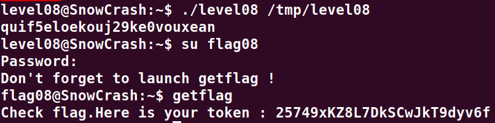

# Level08:

**A la racine on y trouve le code suivant:**

```cpp
int main(int argc,char **argv,char **envp) {
  char *pcVar1;
  int __fd;
  size_t __n;
  ssize_t sVar2;
  int in_GS_OFFSET;
  int fd;
  int rc;
  char buf [1024];
  undefined local_414 [1024];
  int local_14;
  
  local_14 = *(int *)(in_GS_OFFSET + 0x14);
  if (argc == 1) {
    printf("%s [file to read]\n",*argv);
                    /* WARNING: Subroutine does not return */
    exit(1);
  }
  pcVar1 = strstr(argv[1],"token");
  if (pcVar1 != (char *)0x0) {
    printf("You may not access \'%s\'\n",argv[1]);
                    /* WARNING: Subroutine does not return */
    exit(1);
  }
  __fd = open(argv[1],0);
  if (__fd == -1) {
    err(1,"Unable to open %s",argv[1]);
  }
  __n = read(__fd,local_414,0x400);
  if (__n == 0xffffffff) {
    err(1,"Unable to read fd %d",__fd);
  }
  sVar2 = write(1,local_414,__n);
  if (local_14 != *(int *)(in_GS_OFFSET + 0x14)) {
                    /* WARNING: Subroutine does not return */
    __stack_chk_fail();
  }
  return sVar2;
}
```

**Ce code ouvre un fichier et en lit le contenu a condition qu'il ne contienne pas le mot `token` dans l'adresse du fichier**

**Pour bypass ce probleme il suffit de creer un lien symbolique vers le fichier token**
`ln -sf /home/user/level08/token /tmp/level08`

**On peut maintenant executer le binaire avec le lien en parametre**
`./level08 /tmp/level08`

