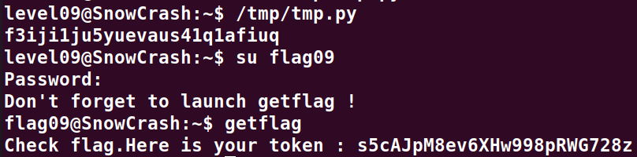

# Level09:

**Le binaire de la session modifi les carateres en leurs ajoutant leurs position dans la chaine**
**Donc on recupere le token en hexadecimal**

**-c 100 pour tout mettre sur une seule ligne et -u pour le mettre en majuscule (dans le but de faciliter le copier coller)**
`xxd -c 100 -u token`

**Et en suite on le passe dans le script python ci-joint pour le decoder**

