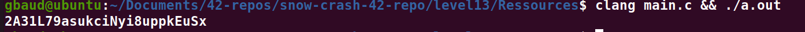

# Level13:

**En arrivant sur le level13 on peut y observer un binaire "level13", en le decompilant avec ghidra on voit que celui-ci contient une condition qui verifie l'uid du programme et qui execute une fonction dans le cas ou l'uid repond a l'egalite**
```cpp
void main(void) {
  __uid_t _Var1;
  undefined4 uVar2;
  
  _Var1 = getuid();
  if (_Var1 != 0x1092) {
    _Var1 = getuid();
    printf("UID %d started us but we we expect %d\n",_Var1,0x1092);
    exit(1);
  }
  uVar2 = ft_des("boe]!ai0FB@.:|L6l@A?>qJ}I"); // ICI un algorithme de DES est visiblement execute
  printf("your token is %s\n",uVar2);
  return;
}
```

**Pour se simplefier la vie, nous allons simplement extraire la chaine 'boe]!ai0FB@.:|L6l@A?>qJ}I' et compiler la fonction ft_des a la main (voir le main.c)**
`clang main.c && ./a.out`
**Une fois le script lance on voit le flag apparaitre**

